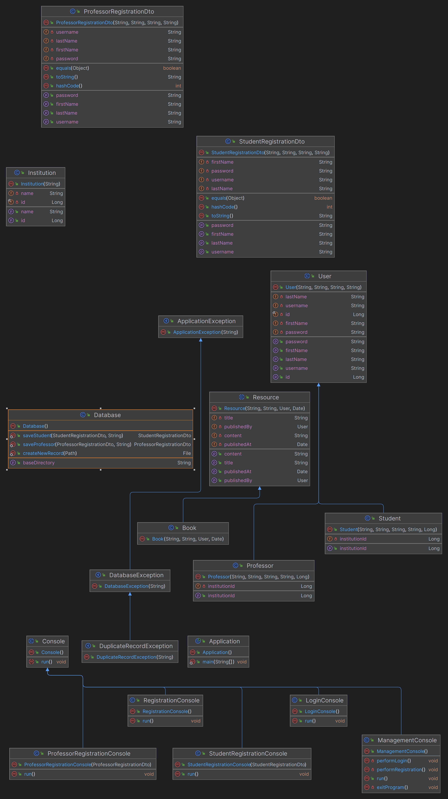

# Library Management System

Welcome to the Library Management System project developed by students of the Introduction to Object-Oriented
Programming course (CS120) at the American University of Armenia.

## UML Class Diagram

The latest UML diagram has been generated for the commit a3d34acb27d9d9ca254546c1ba18227793f41ecb.



## Overview

The Library Management System project is a comprehensive software solution developed by students of the Introduction to
Object-Oriented Programming course (CS120) at the American University of Armenia. The system aims to provide an
efficient and user-friendly platform for managing library operations in educational institutions, public libraries, and
other similar organizations.

Please note that while the Library Management System project is developed with high-quality standards and best
practices, it is primarily an educational project created for learning purposes. It is not intended for production use
in real-world library environments.

## Authors

- Koryun Grigoryan <koryun_grigoryan@edu.aua.am>
- Mikayel Grigoryan <mikayel_grigoryan@edu.aua.am>
- Tigran Melkonyan <tigran_melkonyan@edu.aua.am>

## Features

- User authentication and authorization system.
- CRUD (Create, Read, Update, Delete) operations for managing books, users, and other resources.
- Borrowing and returning books functionality.
- Search functionality for finding books by title, author, etc.

<!-- ## Getting Started
To run the application, follow these steps:
1. Clone the repository to your local machine.
2. Open the project in your preferred IDE (Integrated Development Environment).
3. Build and run the project.
4. Follow the instructions provided by the CLI to navigate through the system and perform various tasks.
-->

## Running the Program

The program uses the Gradle build system for all the tasks related to building and distributing the JAR files.
To run the program, follow the steps below:

1. Install OpenJDK (preferably version 19) on your system.
2. Clone the repository to your local machine from GitHub via Git using the following command:

```shell
git clone --depth=1 https://github.com/michaelgrigoryan25/LibraryManagementSystem
```

3. `cd`into the directory and trigger the following Gradle run script:

```shell
./gradlew --console plain run
```

That's it! You've successfully started the library management system on your local machine.

Optionally, you can also provide a path to the directory where you plan to store
all the files related to the system, including users, books, etc. by specifying a
positional CLI argument:

```shell
./gradlew --console plain run ./resources/
```

## Contributing

We welcome contributions from the community. If you find any issues or have suggestions for improvements, please feel
free to open an issue or submit a pull request.

## License

This project is licensed under the MIT License - see the [LICENSE](LICENSE) file for details.
